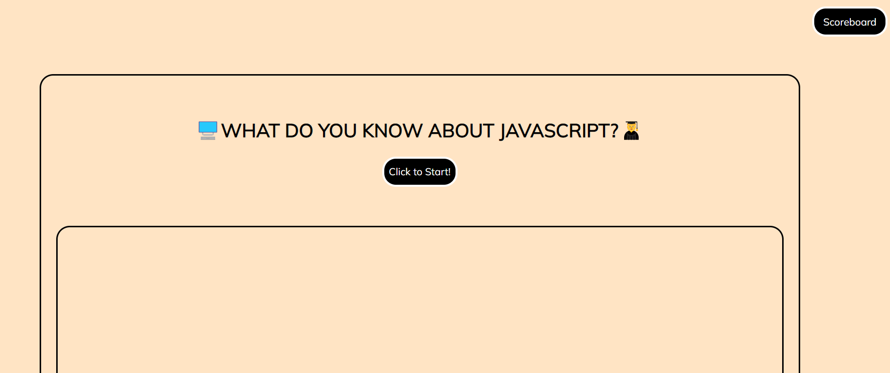
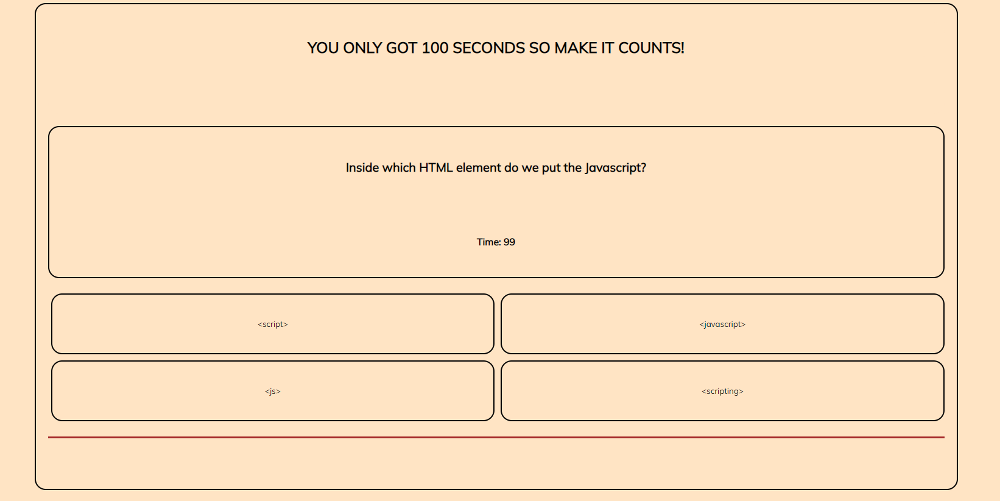
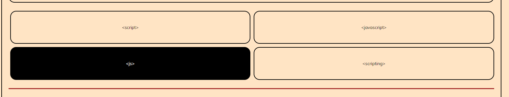
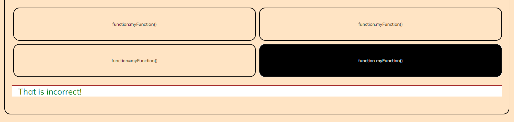
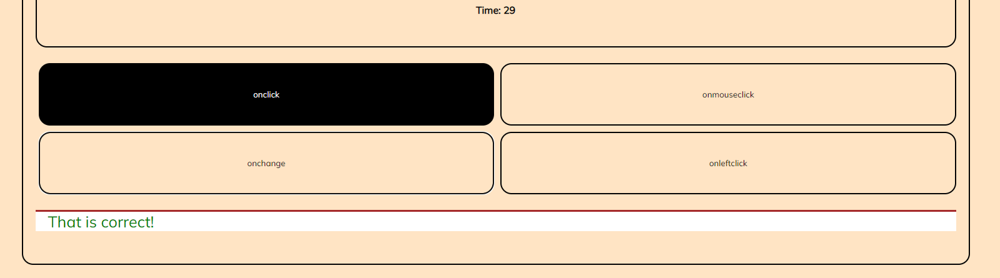
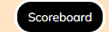
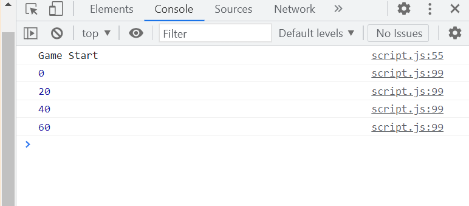

# Javascript-Quizlet

## Description

The motive for this project was to create an Mini Quiz application using HTML, CSS and mostly Javascript to communicate with web browsers. This project requires much more research and lots of changing, learning and debugging. Overall, this Quiz application project was a great opportunity to have a better understanding of how Javascript works behind the browswer. 

## Installation

<li> First, create a GitHub repository that contains a README and license files. </li>
<li> Then, navigate to the appropriate path and Git clone files there. </li>
<li> Create neccessary elements in Index file and use CSS to apply layouts and colors for the application.</li>
<li> Finally, use Script.js to communicate with the web browsers and complete the application. </li>
<li> Follow GitFlow throughout the process to save all local files to GitHUb. </li>
<li> Publish site and test all requirements to meet client's needs. </li>

## Links

<li> GitHub Repo URL: </li>

https://github.com/nathantr97/Javascript-Quizlet

<li> Application Live URL: </li>

https://nathantr97.github.io/Javascript-Quizlet/

## Usage

<li> Click on "Click to Start" button to proceed to the quiz.</li>

<li> User has 100 seconds to complete 5 questions. Every correct answer user will receive 20 points and 20 points will be deducted for every incorrect answer unless user has no 0 points </li>

<li> Button background will turn black and text will turn white to indicate which button is hovered. </li>

<li> The application will notify users at the bottom of the page whether their selection was correct or incorrect.</li>

<li> Scoreboard button will show user's scores. <li>

<li> Open Console under Inspect to see how user's selections were scored </li>

## Credits

<li> W3 School HTML DOM ELEMENT addEventListener() </li>

https://www.w3schools.com/jsref/met_element_addeventlistener.asp

<li> W3 Color Picker </li>

https://www.w3schools.com/colors/colors_picker.asp

<li> W3 School Javascript Functions </li>

https://www.w3schools.com/js/js_functions.asp

